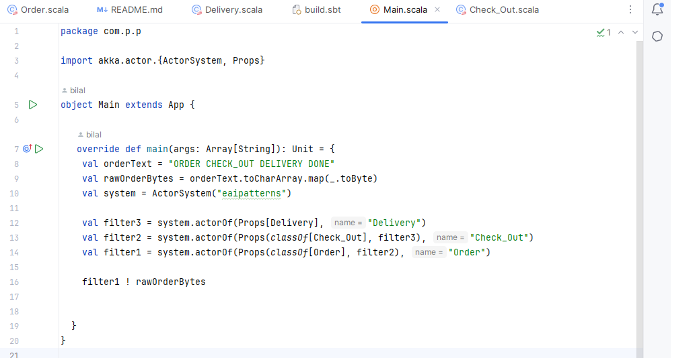

# Pipes_and_filters
Pipes and filters pattern implementation using akka and scala

When using the Pipes and Filters architecture, you compose a process by chaining together any number of
processing steps. Each of the steps is decoupled from the others. Thus, each of the steps could be
rearranged or replaced as the need arises.

### order actor

### main function

